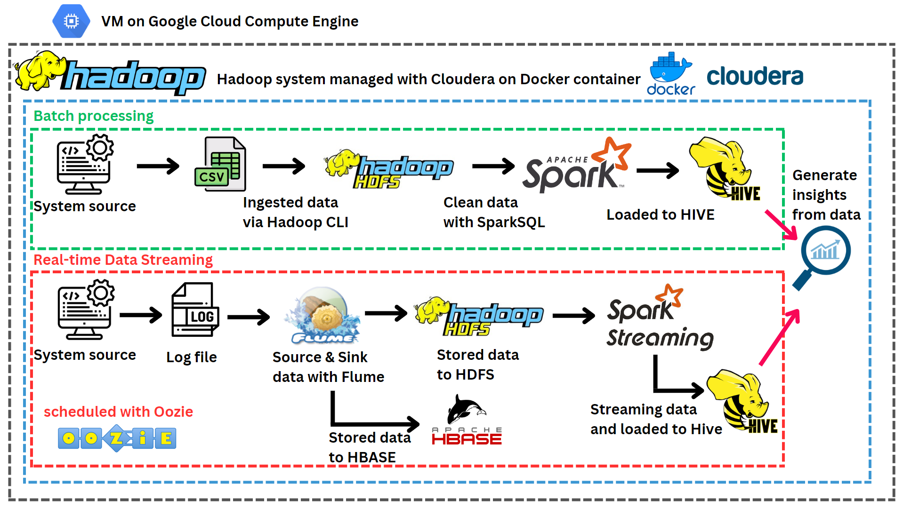

# Real time Data Streaming on Hadoop ecosystem
## Project overview

#### End to End Batch processing and Real-time Data streaming on Hadoop ecosystem managed by Cloudera. 
  - **Ingested raw data into Hadoop HDFS via Hadoop CLI**, **clean data** with **SparkSQL**.
  - **Real-time streaming data with Flume**, **stored on HBase** and **Transformed with Spark streaming** then **loaded to Hive**.
  - **Scheduling data workflow with Oozie** and Using HiveQL to generate data insights.
